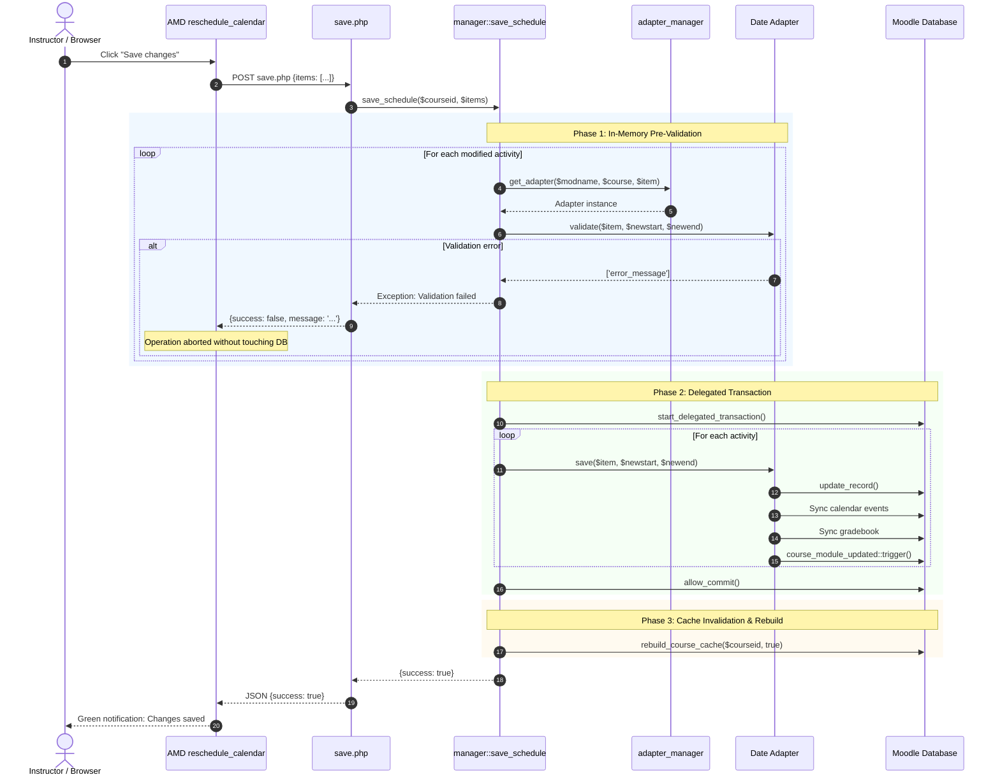

# Activity Rescheduler for Moodle (`local_reschedule`)

**Activity Rescheduler & Interactive Timeline for Moodle**  
A local plugin for Moodle 4.x and 5.x that provides an interactive timeline (GANTT chart) and advanced tools for visual rescheduling, automated sequencing, and precise date editing of course activities with atomic, safe subsystem synchronization.

- **Author:** Juan Pablo de Castro <[juan.pablo.de.castro@gmail.com](mailto:juan.pablo.de.castro@gmail.com)>
- **License:** GNU General Public License v3 or later (GPLv3+)
- **Compatibility:** Moodle 4.05 to Moodle 5.02+ (Boost, Moove, and derived themes with Bootstrap 4 and Bootstrap 5)

---

## Table of Contents
1. [Overview and Purpose](#1-overview-and-purpose)
2. [Key Features](#2-key-features)
3. [User Manual & Operations](#3-user-manual--operations)
   - [Navigating the Interactive Timeline](#navigating-the-interactive-timeline)
   - [Dragging and Resizing](#dragging-and-resizing)
   - [Subactivity and Phase Management](#subactivity-and-phase-management)
   - [Interactive Jump from GANTT to Detail Table](#interactive-jump-from-gantt-to-detail-table)
   - [Manual Date & Time Editing (Standard Modal)](#manual-date--time-editing-standard-modal)
   - [Auto-Sequencing Strategies](#auto-sequencing-strategies)
4. [Configuration & Activity Mapping](#4-configuration--activity-mapping)
5. [Installation & Deployment](#5-installation--deployment)
6. [ANNEX: Software design notes](#annex-software-design-notes)
   - [The Pitfall of Direct Database Modification](#the-pitfall-of-direct-database-modification)
   - [Cascade Safe Adapter Engine](#cascade-safe-adapter-engine)
   - [Autonomous Extractor Subsystem (Independence from `report_editdates`)](#autonomous-extractor-subsystem-independence-from-report_editdates)
   - [Safe Modification Lifecycle (Atomic Transaction)](#safe-modification-lifecycle-atomic-transaction)
   - [Project Structure](#project-structure)

---

## 1. Overview and Purpose

In university and corporate training courses, Moodle courses often comprise dozens of interconnected activities (assignments, quizzes, workshops, forums, gamified challenges). When the academic calendar shifts or an instructor needs to reorganize their course, modifying dates individually activity by activity is tedious, prone to inconsistencies, and detached from the overall course timeframe.

`local_reschedule` solves this need by providing:
1. An **interactive bird's-eye view (GANTT-style timeline)** of the course with adaptive scales (Year / Month / Day / Hour) and intelligent weekend shading based on the active locale.
2. A **touch- and pointer-enabled direct manipulation system** to move and resize activities in real time.
3. A **safe date synchronization engine** that not only updates the database, but also propagates changes to official Moodle calendar events, the gradebook, and course caches, ensuring complete referential integrity.

---

## 2. Key Features

- **100% responsive, fluid GANTT timeline**: 3-tier multilevel time headers, reference grid, and visual weekend shading.
- **Bidirectional bar manipulation**: Lateral resize handles supporting stretch from both left (start) and right (end), even on very short activities where handles overlap.
- **Harmonic subactivity synchronization**: Moving a parent activity (e.g., a workshop or a `mod_quest` challenge) shifts its subactivities/phases in tandem; resizing it proportionally scales subactivities while respecting bounds.
- **Interactive jump with highlight**: A single click on any GANTT bar automatically unfolds the activity (if collapsed), smoothly scrolls to its row in the detail table, and emits a highlight pulse animation.
- **Manual editing via standard modal**: Clicking date cells in the table opens a modal with standard `<input type="datetime-local" class="form-control">` pickers, live duration preview, and semantic validations.
- **Three assisted auto-sequencing strategies**:
  - *Equal distribution*: Divides the course duration equally among activities.
  - *Sequential chaining*: Chains activities consecutively while preserving their current durations.
  - *Bounded proportional*: Distributes time according to the relative weights of each activity while capping outsized values.
- **Total autonomy**: Does not require the `report_editdates` plugin to be installed, replicating and isolating the entire extractor subsystem.

---

## 3. User Manual & Operations

### Navigating the Interactive Timeline
The timeline can be accessed from the course secondary navigation: **More > Reschedule dates** (`/local/reschedule/index.php?id={courseid}`).
- **Top time header**: Displays the timeline divided into 3 tiers (Year, Month, Day for long periods; Month, Day, Hours for short periods $\le 7$ days).
- **Weekend bands**: Saturdays and Sundays are subtly shaded across the lane background according to the user's active locale (`Intl.Locale`).
- **Fixed left column**: Lists activities with their official icon, title, type, and current duration.

### Dragging and Resizing
- **Moving an activity**: Click and hold the center body of the GANTT bar. Drag left or right. A floating HUD displays updated start and end dates in real time. Movement automatically snaps to hours or minutes.
- **Resizing start date**: Hover over the left edge of the bar (`col-resize` cursor) and drag.
- **Resizing end date**: Hover over the right edge and drag.
- **Narrow or very short bars**: If a bar is narrower than 24 pixels and handles overlap, the system detects whether the click occurred on the left or right half of the bar, allowing stretch in either direction without blockage.

### Subactivity and Phase Management
For compound activities (e.g., `workshop` with submission and assessment phases, or `quest` with `quest_submissions` challenges):
- **`+` / `-` toggle button**: Allows folding or unfolding subtasks both in the GANTT column and in the detail table.
- **Synchronized movement**: Moving the parent activity shifts all its subactivities by the exact same number of hours/days in parallel.
- **Proportional resizing**: Expanding or shrinking the parent activity scales subactivities proportionally, preserving their relative positions within the parent's time window.

### Interactive Jump from GANTT to Detail Table
- Clicking once (**single click** without dragging) on any GANTT bar or row in the left column:
  1. If the activity is a hidden subtask (parent collapsed), the parent expands automatically.
  2. The page performs a smooth scroll (`smooth scroll`), centering the corresponding row in the detail table.
  3. The row emits a blue pulse highlight animation (`.quest-row-highlight`) for 2 seconds for clear visual feedback.
- The system includes a $4\text{px}$ movement tolerance threshold to avoid accidental jumps during drag or resize operations.

### Manual Date & Time Editing (Standard Modal)
In the activity table below:
1. The **Start date** and **End date** columns display a pencil micro-icon on hover.
2. Clicking any cell (or selecting it via keyboard and pressing `Enter`), opens the `#reschedule-date-modal`.
3. The modal uses native HTML5/Bootstrap components compatible with Moodle (`<input type="datetime-local" class="form-control">`), allowing manual keyboard input or local date/time picker interaction.
4. Includes informative badges showing activity type and real-time computed duration.
5. Upon saving, if it is a parent activity, its subactivities are proportionally recalculated to the new window and both table and timeline are updated.

### Auto-Sequencing Strategies
Clicking the **Auto-sequence** button in the top bar opens the strategy selector:
1. **Equal distribution (`equal`)**: Divides the course duration into $N$ identical blocks and distributes primary activities in a continuous chain.
2. **Sequential chaining (`sequential`)**: Concatenates activities one after another starting from course start, preserving each activity's existing duration.
3. **Bounded proportional (`proportional`)**: Calculates total relative duration and scales all activities to fill the course period, applying containment thresholds to prevent outliers from monopolizing the timeline.

---

## 4. Configuration & Activity Mapping

The plugin allows defining dynamic date discovery rules in **Site administration > Plugins > Local plugins > Activity Rescheduler** (`local_reschedule_mapping`).

Each line defines table mapping using comma-separated values:
```text
table_name, title_column, type_label, start_column, end_column [, parent_foreign_key]
```

### Syntax rules:
1. **Primary activities**:
   ```text
   assign, name, Assignment, allowsubmissionsfromdate, duedate
   quiz, name, Quiz, timeopen, timeclose
   choice, name, Choice, timeopen, timeclose
   ```
2. **Subactivities / Phases (prefixed with a hyphen `-`)**:
   The hyphen indicates that the item is a child subtask or phase. The 6th parameter defines the foreign key column linking it to the parent:
   ```text
   quest, name, Questournament, timestart, timefinish
   -quest_submissions, title, Challenge, timestart, timefinish, questid
   ```

---

## 5. Installation & Deployment

### Prerequisites
- Web server running PHP 8.1 or higher.
- Moodle 4.1 LTS, 4.5 LTS, 5.0, or higher.

### Installation steps
1. Clone or copy the plugin folder into the `local/` directory of your Moodle installation:
   ```bash
   git clone https://github.com/juacas/moodle-mod_quest.git local/reschedule # Or copy the package
   # Location must be: {moodle_root}/local/reschedule
   ```
2. Visit the Moodle administration notifications page (`/admin/index.php`) or execute the upgrade via CLI:
   ```bash
   php admin/cli/upgrade.php
   ```
3. Purge Moodle caches:
   ```bash
   php admin/cli/purge_caches.php
   ```

### Frontend Recompilation (Development)
If you make changes to `amd/src/reschedule_calendar.js`:
```bash
node -e '
const fs = require("fs");
let src = fs.readFileSync("amd/src/reschedule_calendar.js", "utf8");
src = src.replace("define([\x27core/notification\x27],", "define(\x27local_reschedule/reschedule_calendar\x27, [\x27core/notification\x27],");
fs.writeFileSync("/tmp/reschedule_calendar.named.js", src);
' && npx terser /tmp/reschedule_calendar.named.js --comments "/@license|@copyright|@author|@package|@module/" -o amd/build/reschedule_calendar.min.js --source-map "url=reschedule_calendar.min.js.map,filename=amd/build/reschedule_calendar.min.js.map"
```

---

## ANNEX: Software design notes

### The Pitfall of Direct Database Modification
In Moodle, an activity is never just an isolated row in a table. Modifying date columns directly via SQL (`$DB->update_record()`) causes severe inconsistencies:
- **Orphan events in `{event}`**: Students continue seeing outdated dates in their timeline, Moodle calendar, and upcoming deadline alerts.
- **Desynchronization in `{grade_items}`**: The gradebook retains outdated due dates.
- **Relative inconsistencies**: In modules like `assign`, if `duedate` exceeds `cutoffdate` or `gradingduedate`, the activity enters an invalid or uneditable state.

### Cascade Safe Adapter Engine

To guarantee comprehensive consistency, `local_reschedule` employs a 3-level cascade resolution factory (`classes/adapter_manager.php`):

```
                       adapter_manager::get_adapter($modname, $course, $item)
                                                 |
         +---------------------------------------+---------------------------------------+
         |                                       |                                       |
    [Level 1: Reschedule]               [Level 2: Extractor Bridge]             [Level 3: Fallback]
  Dedicated custom adapter exists?        Extractor exists (builtin/bridge)?        Safe Generic Adapter
 (assign, quiz, workshop, quest, kuet)                         |                                |
          |                                              |                                |
         YES                                            YES                       Applies standard hooks
          |                                              |                        ({mod}_update_events)
Instantiate dedicated adapter              Instantiate editdates_bridge           and core cm events
```

#### 1. Level 1: Dedicated Custom Adapters (`local_reschedule\adapter\*`)
Top priority for complex modules or those with subphases:
- **`assign_adapter`**: Harmoniously adjusts dependent dates (`cutoffdate`, `gradingduedate`), invoking `$assign->update_calendar()` and `$assign->update_gradebook()`.
- **`workshop_adapter`**: Handles workshops and submission/assessment subphases (`submissionstart/end`, `assessmentstart/end`), synchronizing events via `workshop_calendar_update()`.
- **`quest_adapter`**: Handles `quest` and challenges `quest_submissions`, invoking `quest_update_quest_calendar()`, `quest_update_grades()`, and `quest_update_challenge_calendar()`.
- **`kuet_adapter`**: Handles `mod_kuet` and its scheduled sessions (`kuet_sessions`), managing automated session start flags (`automaticstart = 1`), programmed session modes, reactivation of rescheduled sessions, and course module cache synchronization.
- **`quiz_adapter`**: Validates opening/closing consistency and triggers `quiz_update_events()` and `quiz_grade_item_update()`.

#### 2. Level 2: Extractor Bridge (`local_reschedule\adapter\editdates_bridge`)
Delegates to the extractor subsystem (`extractor_factory`), supporting any Moodle module that has a registered extractor (builtin to `local_reschedule`, in-module integration, or from `report_editdates`).

#### 3. Level 3: Safe Generic Adapter (`local_reschedule\adapter\generic_adapter`)
Fallback for third-party modules without a dedicated adapter or extractor:
- Updates dates with `timemodified = time()`.
- Dynamically invokes standard Moodle hooks if present in `mod/{table}/lib.php`:
  - `{$modname}_update_events($record)`
  - `{$modname}_grade_item_update($record)`
- Triggers the canonical Moodle event `\core\event\course_module_updated::create_from_cm($cm)->trigger()`.

---

### Autonomous Extractor Subsystem (Independence from `report_editdates`)

The plugin implements a complete infrastructure in `classes/extractor/` that **does not require `report_editdates` to be installed**:

1. **Compatibility Shim (`classes/extractor/compat.php`)**:
   - Declares `report_editdates_date_setting` and `report_editdates_mod_date_extractor` if `report_editdates` is absent.
   - Allows autoloaded classes such as `mod_offlinequiz_report_editdates_integration` to execute without triggering `Class not found`.
2. **Replicated Builtin Extractor Catalog (`classes/extractor/builtin/`)**:
   - Complete implementations for: `choice`, `data`, `feedback`, `forum`, `lesson`, `scorm`, `chat`, `glossary`, `questionnaire`, `zoom`, `assign`, `quiz`, `workshop`.
   - Each extractor validates semantic business rules (e.g., open before close, graded forum dependencies) and invokes official post-save routines (`lesson_process_post_save`, `chat_update_instance`, etc.).
3. **Universal Factory (`classes/extractor/extractor_factory.php`)**:
   - Orchestrates resolution in order:
     1. In-module integration class (`mod_{$modname}_report_editdates_integration`).
     2. Replicated builtin extractor in `local_reschedule\extractor\builtin\*`.
     3. Extractor in `report/editdates/mod/` (if the plugin is installed).

---

### Safe Modification Lifecycle (Atomic Transaction)

In `classes/manager.php::save_schedule()`, persistence executes across 3 atomic phases:



---

### Project Structure

```
local/reschedule/
├── amd/
│   ├── build/
│   │   ├── reschedule_calendar.min.js      # Minified and optimized JS bundle
│   │   └── reschedule_calendar.min.js.map  # Source map for debugging
│   └── src/
│       └── reschedule_calendar.js          # ES5/AMD module with interactive timeline logic
├── classes/
│   ├── adapter/                            # Cascade adapter engine
│   │   ├── adapter_interface.php          # Canonical interface contract (supports, validate, save)
│   │   ├── base_adapter.php               # Base class with helpers (get_cm, modinfo, DB)
│   │   ├── assign_adapter.php             # Safe handler for mod_assign
│   │   ├── quiz_adapter.php               # Safe handler for mod_quiz
│   │   ├── workshop_adapter.php           # Safe handler for mod_workshop and phases
│   │   ├── quest_adapter.php              # Safe handler for mod_quest and challenges
│   │   ├── kuet_adapter.php               # Safe handler for mod_kuet and scheduled sessions
│   │   ├── editdates_bridge.php           # Bridge to extractor subsystem
│   │   └── generic_adapter.php            # Safe reflective fallback for third-party modules
│   ├── extractor/                         # Autonomous extractor subsystem
│   │   ├── compat.php                     # Shim for report_editdates_mod_date_extractor
│   │   ├── base_builtin_extractor.php     # Base class with translation helpers
│   │   ├── extractor_factory.php          # Universal discovery factory
│   │   └── builtin/                       # Catalog of replicated extractors
│   │       ├── assign_extractor.php
│   │       ├── chat_extractor.php
│   │       ├── choice_extractor.php
│   │       ├── data_extractor.php
│   │       ├── feedback_extractor.php
│   │       ├── forum_extractor.php
│   │       ├── glossary_extractor.php
│   │       ├── lesson_extractor.php
│   │       ├── questionnaire_extractor.php
│   │       ├── quiz_extractor.php
│   │       ├── scorm_extractor.php
│   │       ├── workshop_extractor.php
│   │       └── zoom_extractor.php
│   ├── adapter_manager.php                # Adapter factory and resolution
│   └── manager.php                        # Business logic for schedule loading and saving
├── lang/
│   ├── en/local_reschedule.php            # English language strings
│   └── es/local_reschedule.php            # Spanish language strings
├── templates/
│   └── reschedule.mustache                # Mustache template (UI, modals, table)
├── index.php                              # Main view controller
├── lib.php                                # Navigation hooks (course secondary menu)
├── save.php                               # AJAX endpoint for atomic save
├── settings.php                           # Global configuration in Site Administration
├── styles.css                             # CSS styles, animations, and design tokens
└── version.php                            # Plugin metadata (version, requirements)
```
